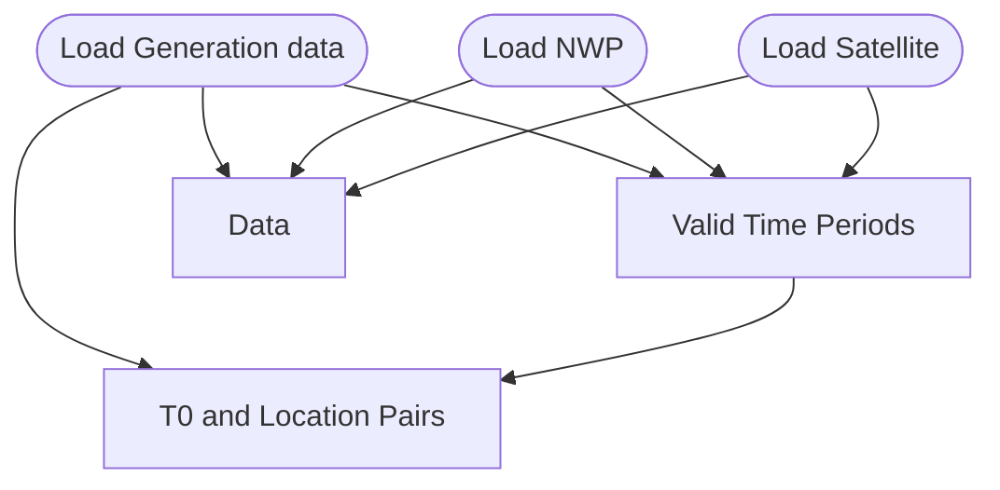
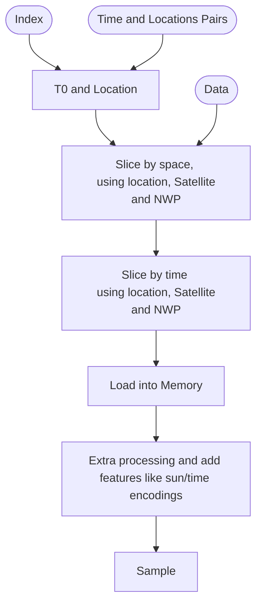

# Torch Datasets

The aim of this folder is to create torch datasets which can easily be used in our ML models and ML deployment that use pvnet.

## generation 

## Note on t0 time (prediction time)
t0 represents the time the forecast is made and relates to a time of one of the generation values.   
This time is important because the available NWP/weather data changes depending on t0. Also to account for live delays in data, t0 is used to assume the correct amount of data that would be available at inference time.

Note that t0 is considered as past of the history we pass to the model and the first forecasted value will be for t0 + time_resolution_minutes of the generation data (e.g. 15 mins or 30 mins). 

## PVNet Dataset

This dataset is for creating samples for PVNet for renewable energy forecasting.

### Init

Starting up this up, we get
- Time and locations Pairs: A list of all valid time and locations for the data. How this is created differs slightly depending on whether there are non overlapping periods.
- Data: The Data is lazily loaded in, and ready to be selected. 

### Get a Sample

