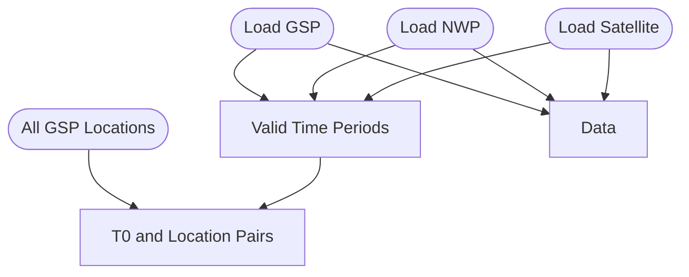
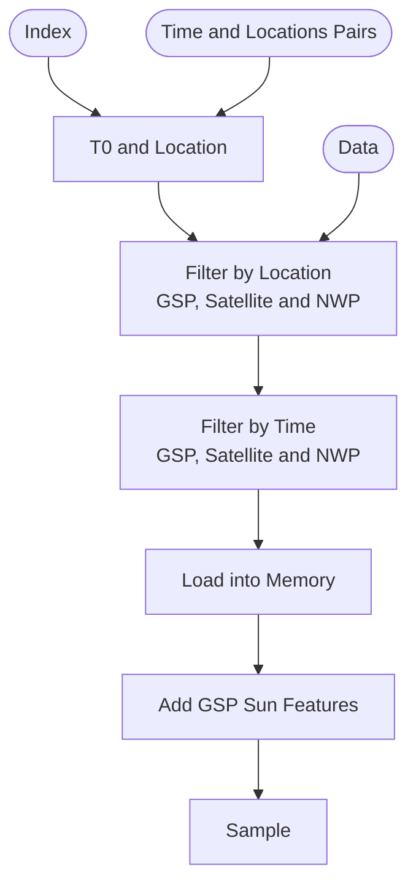
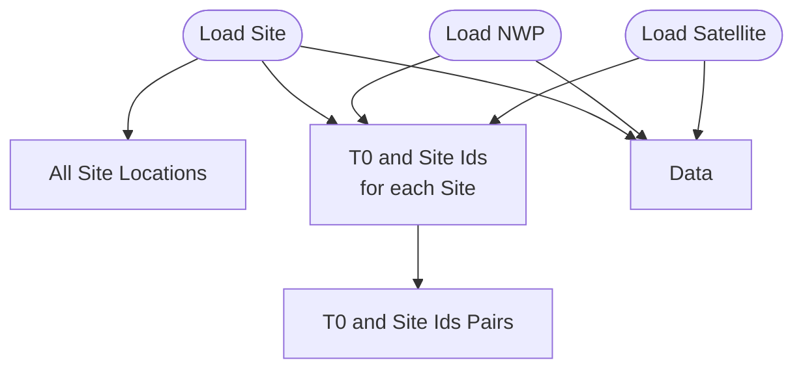
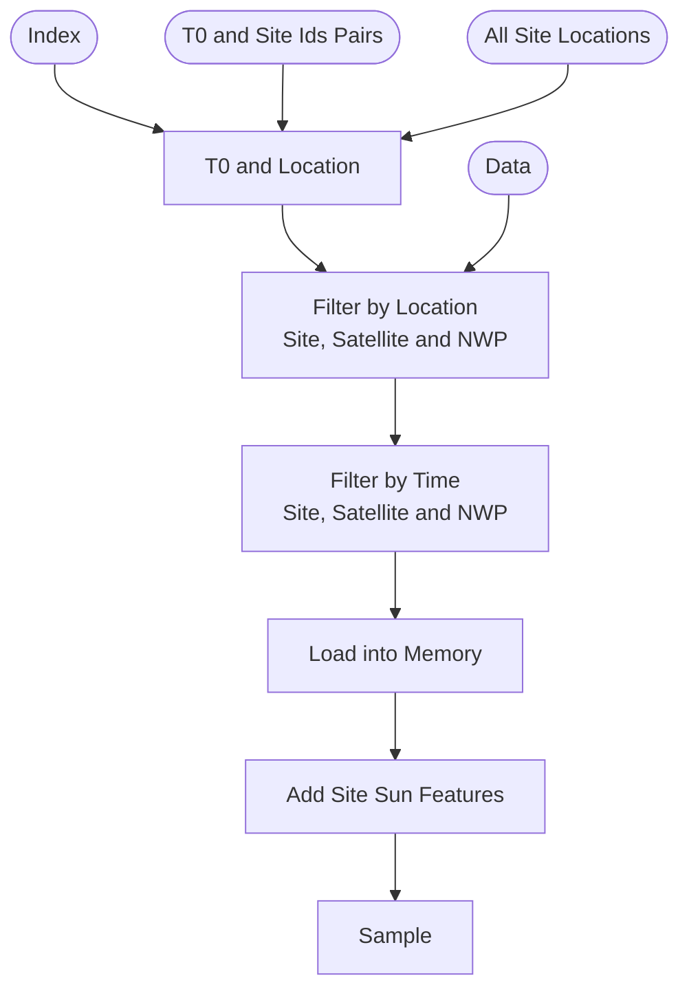

# Torch Datasets

The aim of this folder is to create torch datasets which can easily be used in our ML models and ML deployment.

## PVNet UK Regional

This dataset is for creating GSP predictions which we have used in our PVNet model.

### Init

Starting up this up, we get
- Time and locations Pairs: A list of all valid time and locations for the data
- Data: The Data is lazily loaded in, and ready to be selected. 

### Get a Sample

## Site
The Site torch dataset gets sample for each site. 
This works for mulitple sites with different valid time periods of data

### Get a Sample

